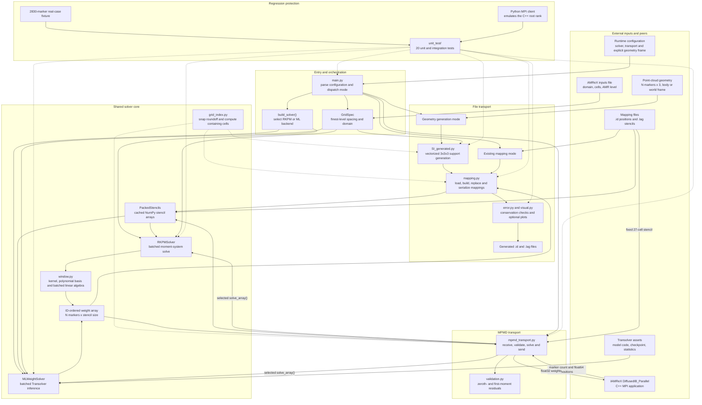
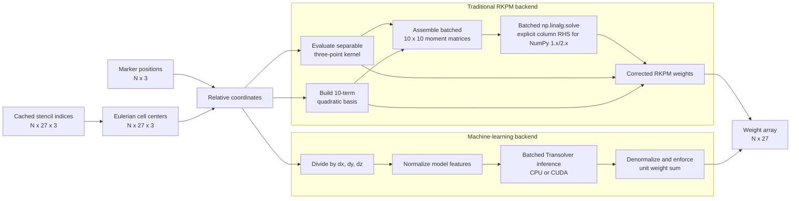

<!--
SPDX-FileCopyrightText: 2026 IAMReX contributors
SPDX-License-Identifier: BSD-3-Clause
-->

# RKPM Weight Architecture

This document is the maintained architecture map for the RKPM Weight tool. It
covers the production modules, runtime modes, solver backends and external data
contracts. Update it in the same change whenever a module responsibility,
dependency, runtime path, command-line option, data shape or MPMD contract
changes.

## System Architecture

## Solver Backend Pipelines

## Module Responsibilities

| Module | Responsibility |
|---|---|
| `main.py` | Parse configuration, construct the grid and solver, and dispatch file or MPMD execution. |
| `src/SI_generated.py` | Read and transform geometry, estimate marker volume, and construct vectorized support domains. |
| `src/grid_index.py` | Apply the shared grid-line snapping convention and compute containing-cell indices. |
| `src/mapping.py` | Read, validate, build, update and write `.id/.lag` mappings. |
| `src/weight_solver.py` | Pack static stencils, cache reusable arrays, batch markers and expose RKPM/ML solver backends. |
| `src/window.py` | Evaluate the RKPM kernel, polynomial basis, moment matrices and corrected weights with NumPy. |
| `src/mpmd_transport.py` | Implement the single-rank Python MPI server and its wire protocol with IAMReX. |
| `src/validation.py` | Compute zeroth- and first-moment residuals on the exact weight array sent to C++. |
| `src/error.py` | Compute vectorized volume, force and torque conservation diagnostics for file mode. |
| `src/visual.py` | Produce optional point-cloud and support-domain diagnostic plots. |
| `unit_test/` | Protect numerical reproduction, batching, mapping, support generation, validation and MPI transport. |

## Runtime Data Contracts

| Data | Shape / type | Owner and lifetime |
|---|---|---|
| Marker positions | `(N, 3)`, float64 | Loaded from `.id` in file mode or received from IAMReX every MPMD exchange. |
| Point-cloud frame | Explicit body or world frame | Body-frame coordinates are translated by `particle_inputs.{x,y,z}`; world-frame coordinates are used unchanged. |
| Stencil indices | `(N, 27, 3)`, integer | Loaded from `.lag`, packed once and cached for the solver lifetime. |
| RKPM metadata | `eps` per stencil row | Loaded from `.lag`; traditional RKPM recovers each marker's Lagrangian volume from it. |
| Solver weights | `(N, 27)`, floating point | Produced in marker-ID and `.lag` row order by either backend. |
| MPMD positions | flat `N*3`, `MPI_DOUBLE` | Sent from the C++ root rank to the Python server. |
| MPMD weights | flat `N*27`, `MPI_FLOAT` | Sent from the Python server to the C++ root rank. |

The current MPMD protocol transfers new weights but not new stencil indices.
Consequently, marker motion is valid only while every marker remains inside the
center cell of its cached 3x3x3 stencil. `validate_fixed_stencils()` aborts or
reports the mismatch before stale indices can be used.

## Architecture Maintenance Checklist

When production code changes, review this document in the same pull request:

1. Update the system diagram if a module, dependency or runtime path changes.
2. Update the backend diagram if RKPM or ML preprocessing and inference changes.
3. Update the data-contract table if a shape, dtype, file field or MPI message changes.
4. Update the module table when files are added, removed or assigned new responsibilities.
5. Update the test count and verification nodes after changing the test suite.
